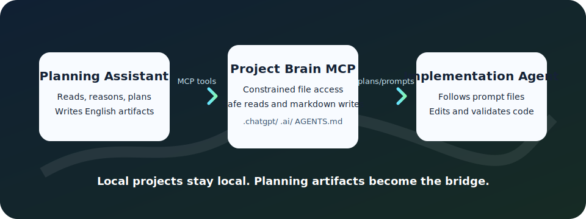

# Project Brain MCP

Project Brain MCP is a local-first remote MCP server that gives a planning assistant controlled access to your project folders. It is designed for a split workflow: the planning assistant reads and analyzes the codebase, writes English plans and implementation prompts, then a separate implementation agent uses those artifacts as the coding brief.



The server is intentionally narrow. It can inspect safe project files, search code, and write markdown planning artifacts. It does not run shell commands, edit application source files, or expose secrets.

## What It Does

- Exposes a streamable HTTP MCP endpoint at `/mcp`.
- Lists project folders under configured roots and detects common stacks when signals exist.
- Inspects project structure, reads safe text files, and searches file contents.
- Creates quick phased implementation plans under `.chatgpt/quick-plans/` for scoped work.
- Runs strict manual-gated planning workflows under `.chatgpt/workflows/`.
- Creates generic implementation prompts under `.chatgpt/implementation-prompts/`.
- Bootstraps project-root `AGENTS.md` so downstream coding agents understand the workflow.
- Logs tool calls for auditability.
- Supports Cloudflare Tunnel for ChatGPT Developer Mode access without opening inbound ports.

## Security Model

- Default mode is `planning_write`: read allowed files, search, inspect, and write markdown-only planning artifacts.
- Writes are limited to `.chatgpt/`, `.ai/`, the exact project-root `AGENTS.md`, and root `fromgpt.md` for planning-assistant messages.
- Source files, environment files, credentials, generated dependency directories, and secret-like files are blocked.
- Path canonicalization rejects traversal, symlink escapes, and absolute path bypasses.
- Secret redaction is applied before file contents are returned.
- The server does not expose a generic command execution tool.

## Quick Start

### 1. Build The Server

```bash
go build ./cmd/server
```

### 2. Run Locally

```bash
./server --config ./configs/project-brain.example.yml
```

The server listens on `127.0.0.1:3939` by default.

### 3. Check Health

```bash
curl http://127.0.0.1:3939/healthz
```

### 4. Run Doctor

```bash
./server doctor --config ./configs/project-brain.yml --public-url https://<your-public-host>
```

Doctor checks local health, public tunnel health, configured root access, OAuth issuer configuration, and `cloudflared` availability. Use it first when ChatGPT can see the tool catalog but tool calls fail with upstream or external service errors.

### 5. Connect From ChatGPT

Use a tunnel URL that points to the local server, then configure the MCP app endpoint as:

```text
https://<your-public-host>/mcp/
```

See [ChatGPT setup](docs/CHATGPT_SETUP.md) for the full configuration flow.

## Project Structure

```
project-brain-mcp/
  cmd/server/main.go          # Entry point
  internal/
    app/                      # Config loader
    auth/                     # Auth middleware (dev / OAuth)
    mcpserver/                # MCP server and tools
    fsx/                      # Filesystem sandbox, read, write, search
    project/                  # Project detection and inspection
    plans/                    # Markdown generator
    audit/                    # Audit logger
    security/                 # Rate limiting
  configs/                    # Example configs
  docs/                       # Documentation
```

## MCP Tools

| Tool | Description |
|------|-------------|
| `get_project_brain_guide` | Return the reusable Project Brain MCP operating guide |
| `list_roots` | List configured project roots |
| `list_projects` | Discover projects under a root |
| `inspect_project` | Structured project overview |
| `get_project_tree` | Filtered file tree |
| `read_project_file` | Read an allowed file |
| `search_project` | Search file contents |
| `bootstrap_project_agents_md` | Write a standard project-root `AGENTS.md` |
| `create_quick_plan` | Write one short phased implementation plan for scoped work |
| `start_planning_workflow` | Start a strict multi-phase planning workflow |
| `get_planning_workflow_status` | Read workflow state |
| `get_current_planning_phase` | Read the active phase contract |
| `complete_planning_phase` | Write the current phase artifact and wait for user approval |
| `approve_planning_phase` | Advance after explicit user approval |
| `finalize_planning_workflow` | Write the final dossier and implementation prompts |
| `read_togpt_message` | Read root `togpt.md` written by an implementation agent |
| `append_fromgpt_message` | Append a timestamped planning-assistant message to root `fromgpt.md` |

## Quick Plan Workflow

For small or medium scoped implementation work, use Quick Plan:

1. Inspect the project with `inspect_project`, `get_project_tree`, `read_project_file`, and `search_project`.
2. Call `create_quick_plan` with a narrow objective, current context, 3-5 phases, acceptance criteria, tests, and risks.
3. Set `create_implementation_prompt` to true when you also need a downstream implementation-agent brief.
4. Give the generated implementation prompt to your chosen implementation agent from the target project root.

Quick Plan is intended for bug fixes, UI adjustments, small endpoint additions, focused refactors, and test additions. Use the full workflow for product planning, architecture, migrations, auth/permission changes, billing/payment work, production-critical refactors, or broad multi-module features.

## Full Planning Workflow

For serious product planning, use the staged workflow instead of one large answer:

1. Start with `start_planning_workflow`.
2. Complete only the current phase with `complete_planning_phase`.
3. Review the artifact with the user.
4. When the user explicitly says to continue, call `approve_planning_phase`.
5. Repeat until `10-review-test` is approved.
6. Call `finalize_planning_workflow` to write `final/master-plan.md` and implementation prompts.
7. Run your chosen implementation agent from the target project root and pass a generated prompt file:

```powershell
<agent-command> < ".chatgpt/implementation-prompts/<prompt-file>.md"
```

Implementation happens outside the MCP server in the implementation agent's own runtime and approval model. Freeform planning and prompt tools are intentionally not exposed; serious planning must go through the workflow gate.

Implementation agents should read `fromgpt.md` before working and write `togpt.md` after each assigned task. Project Brain can read `togpt.md` and append timestamped follow-up messages to `fromgpt.md`.

## Tunnel Choice

`launch.bat` and `launch.sh` use a Cloudflare Quick Tunnel. This is good for testing and local iteration, but the URL is random and temporary. When the URL or OAuth secrets change, reconnect the Project Brain app in ChatGPT because issued OAuth tokens are bound to the issuer URL and signing key.

For daily use, prefer a named Cloudflare Tunnel with your own hostname. Point that hostname to `http://127.0.0.1:3939`, set `server.public_base_url` / `auth.issuer_url` to the stable HTTPS URL, then use `https://<your-hostname>/mcp/` in ChatGPT.

If the public endpoint returns Cloudflare 502, the tunnel reached Cloudflare but could not get a valid response from the local service. If it returns Cloudflare 1033, the hostname has no active tunnel connection. In both cases, run `server doctor --config configs/project-brain.yml --public-url https://<your-public-host>` before changing MCP tools.

## Documentation

- [Security Guide](docs/SECURITY.md)
- [ChatGPT Setup](docs/CHATGPT_SETUP.md)
- [Tool Contracts](docs/TOOL_CONTRACTS.md)
- [Testing](docs/TESTING.md)
- [Legacy Kimi Workflow](docs/KIMI_WORKFLOW.md)

## License

MIT
