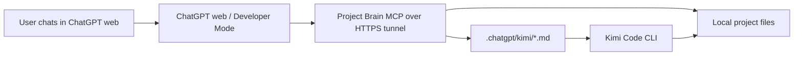

# ChatGPT Brain to Kimi Code CLI Workflow

Verified on 2026-05-14 against the current OpenAI ChatGPT Developer Mode documentation and Kimi Code CLI documentation.

## Architecture



## Roles

- ChatGPT is the planner, reviewer, and prompt author.
- Project Brain MCP is the constrained file access layer for ChatGPT.
- Kimi Code CLI is the implementation agent.
- The user approves what gets connected, what prompts are run, and any Kimi actions that require confirmation.

## Why This Shape

ChatGPT custom MCP apps require a remote server URL, so a local-only MCP endpoint is not enough for ChatGPT web. Cloudflare Tunnel is a practical way to expose the local server over HTTPS without opening inbound firewall ports.

Kimi Code CLI supports one-shot prompts through `--prompt` / `-p` and can be scoped to a working directory with `--work-dir`. That makes a generated markdown prompt file a clean bridge between ChatGPT planning and Kimi implementation.

## Recommended Flow

1. Ask ChatGPT to inspect the target project with Project Brain.
2. Ask ChatGPT to create an English implementation plan with `create_agent_plan`.
3. Ask ChatGPT to create a Kimi prompt with `create_kimi_prompt`.
4. Review the generated `.chatgpt/kimi/*.md` file if needed.
5. Run Kimi from the project root:

```powershell
kimi --work-dir <project-root> --prompt (Get-Content -Raw ".chatgpt/kimi/<prompt-file>.md")
```

For bash-compatible shells:

```bash
kimi --work-dir <project-root> --prompt "$(cat .chatgpt/kimi/<prompt-file>.md)"
```

## Kimi Setup Notes

Install Kimi Code CLI on Windows:

```powershell
Invoke-RestMethod https://code.kimi.com/install.ps1 | Invoke-Expression
```

Then verify:

```powershell
kimi --version
```

Run `kimi`, then use `/login` to configure Kimi Code or a Kimi API provider. Kimi's default config is stored under `~/.kimi/config.toml`.

## Guardrails

- Do not expose a generic shell execution tool through Project Brain MCP.
- Keep generated plans and prompts in English.
- Keep implementation prompts concrete: objective, plan path, relevant files, constraints, acceptance criteria.
- Prefer one Kimi prompt per implementation task.
- Ask Kimi to report changed files and validation commands in its final response.

## Current Limitation

This project does not create a fully autonomous ChatGPT-to-Kimi control loop. ChatGPT web writes the prompt artifact; the user or a separately approved local runner starts Kimi CLI. That boundary is intentional because command execution through a public MCP endpoint would materially increase risk.

## Source Checks

- OpenAI Developer Mode currently supports remote MCP apps over SSE or streamable HTTP, with OAuth, no-auth, or mixed authentication.
- OpenAI recommends OAuth with CIMD when supported, and still supports DCR when configured. Project Brain uses a static public client ID because it does not implement CIMD or DCR yet.
- Cloudflare Quick Tunnels generate random `trycloudflare.com` subdomains and are intended for testing/development rather than production.
- Kimi Code CLI documents `--work-dir` / `-w` for setting the working directory and `--prompt` / `-p` for passing a one-shot prompt.
